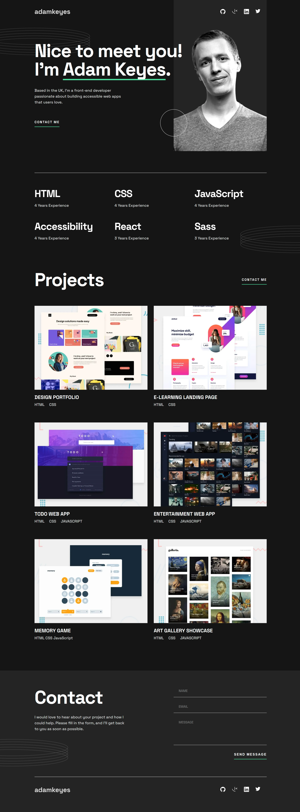

# Frontend Mentor - Single-page developer portfolio solution

This is a solution to the [Single-page developer portfolio challenge on Frontend Mentor](https://www.frontendmentor.io/challenges/singlepage-developer-portfolio-bBVj2ZPi-x). Frontend Mentor challenges help you improve your coding skills by building realistic projects. 

## Table of contents

- [Overview](#overview)
  - [The challenge](#the-challenge)
  - [Screenshot](#screenshot)
  - [Links](#links)
- [My process](#my-process)
  - [Built with](#built-with)
  - [What I learned](#what-i-learned)
  - [Continued development](#continued-development)
- [Author](#author)
- [Acknowledgments](#acknowledgments)

## Overview

In this submission, you will see the solution to the standard project, meaning as it is offered in Frontend Mentor. For this submission, I took the simplest approach and excluded the bonus challenges. My plan is to resubmit the challenge after I have altered it to represent my own details, images, etc. 

### The challenge

Users should be able to:

- Receive an error message when the `form` is submitted if:
  - Any field is empty
  - The email address is not formatted correctly
- View the optimal layout for the interface depending on their device's screen size
- See hover and focus states for all interactive elements on the page

Additional challenges:

- Supply user feedback if the form is submitted correctly by creating an overlay on the form with a feedback message

The following will not be added until the second submittion:

- **Bonus**: Hook the form up so it sends and stores the user's enquiry (you can use a spreadsheet or Airtable to save the enquiries)
- **Bonus**: Add your own details (image, skills, projects) to replace the ones in the design

### Screenshot

The following is the full-sized screenshot (width: 1140px). Other size screenshots, for tablet and mobile, are found in the "screenshots" folder.

### Links

- Solution URL: [Add solution URL here](https://your-solution-url.com)
- Live Site URL: [Add live site URL here](https://your-live-site-url.com)

## My process

While I kept the same workflow as before, I did try and develop my CSS structure a bit more, divinding the global and local stylesheets into separate pages. This way, I could create global styles that will keep a multiple website consistent in look (and facilitate changes) while allowing individual pages to demonstrate uniqueness.

### Built with

- Semantic HTML5 markup
- CSS custom properties
- Flexbox
- JavaScript
- Mobile-first workflow
- [jQuery](https://jquery.com/) - jQuery main library

### What I learned

This is the first time I have attempted this level of a project through Frontend Mentor. While the project was larger in scale, which certainly increases its difficulty, it only included (thankfully!) a few more difficult problems, and hence, a need to hone my skills in those areas:
1. Using .svg files - for some reason, my brain resists picking up the basic concepts of svg and what parts of the file can, and cannot be manipulated through CSS.
  - If I try to use an `` and link to the svg file, the color changes on hover or as retrieved and manipulated through jQuery is elusive. 
  - If I try to change the width and height independently through CSS, I get cropped icons. According to some research, this could be due to the viewBox; however, manipulating this attribute results in an error and doesn't work anyway. 
  - Neither MDN nor W3Schools does a good job in filling in the conceptual gaps to make things work for me. Even independent articles and Stack Overflow Q&A were not helpful.
  -Eventually, I resorted to using the "scale" property in CSS to change the size of the social media icons for the mobile-size version.
2. Other challenges:
  - Converting the project overlays into inline text.
  - Creating major structural changes at the query breaks

### Continued development

As stated above, the second submission will use Node.js and MongoDB to actually create and send an email plus store the user's information to build a contact list.

## Author

- Website - [Add your name here](https://www.your-site.com)
- Frontend Mentor - [@yourusername](https://www.frontendmentor.io/profile/yourusername)
- Twitter - [@yourusername](https://www.twitter.com/yourusername)

## Acknowledgments

This is where you can give a hat tip to anyone who helped you out on this project. Perhaps you worked in a team or got some inspiration from someone else's solution. This is the perfect place to give them some credit.

**Note: Delete this note and edit this section's content as necessary. If you completed this challenge by yourself, feel free to delete this section entirely.**
